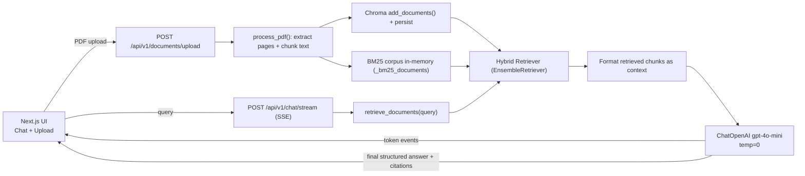

# DocuMind Feature & Functionality Report

Date: 2026-02-22

This report is based on static analysis of the code currently present in:

- `backend/` (FastAPI + LangChain-based RAG pipeline)
- `frontend/` (Next.js App Router UI)

There is no root-level README or backend dependency manifest in the repository, so runtime behavior is inferred strictly from the source.

---

## 1. Product Summary (What DocuMind Does Today)

DocuMind is a local, single-page web app for document-grounded Q&A over uploaded PDFs:

- A user uploads a PDF in the UI.
- The backend extracts text per page, splits it into chunks, embeds the chunks, and stores them in a Chroma vector store.
- Queries are answered using a hybrid retrieval strategy (dense vector search + BM25 lexical search).
- Answers are generated by an LLM with a strict “use only the provided context” system prompt and returned with citations.
- The UI renders the assistant response as Markdown and displays citations as clickable badges; clicking a citation shows its quoted source snippet and page metadata.

---

## 2. High-Level Architecture

### 2.1 Components

Frontend (`frontend/`, Next.js):

- Single route: `frontend/src/app/page.tsx` renders two panels:
  - `frontend/src/components/ChatInterface.tsx` (chat + citations)
  - `frontend/src/components/DocumentPanel.tsx` (PDF upload + active citation viewer)
- Backend URLs are hard-coded to `http://localhost:8000/...` in:
  - `frontend/src/lib/chat-api.ts`
  - `frontend/src/components/DocumentPanel.tsx`

Backend (`backend/`, FastAPI):

- Entrypoint: `backend/main.py`
- Core services:
  - `backend/services/document_processor.py` (PDF text extraction + chunking)
  - `backend/services/retriever.py` (Chroma vector store + BM25 + hybrid ensemble)
  - `backend/services/llm_chain.py` (LLM prompt + structured output + streaming)
- Schemas/config:
  - `backend/schemas.py`
  - `backend/config.py`
- Utility/evaluation script:
  - `backend/scripts/evaluate_rag.py`

### 2.2 Request / Data Flow

---

## 3. Backend API Surface

All backend routes are defined in `backend/main.py`.

### 3.1 Health Check

- `GET /health`
  - Returns `{"status": "ok"}`
  - Intended for simple liveness checks.

### 3.2 Document Upload + Indexing

- `POST /api/v1/documents/upload` (multipart form field name: `file`)
  - Validations:
    - Requires a non-empty filename (`400` if missing).
    - Requires non-empty file bytes (`400` if empty).
  - Processing:
    - Extracts page text from the PDF.
    - Drops empty pages.
    - Splits content into overlapping chunks (`chunk_overlap=150`, `chunk_size` configurable).
    - Assigns a `chunk_id` UUID to each chunk.
    - Indexes chunks into Chroma (dense embeddings via OpenAI).
    - Adds chunks to an in-memory BM25 corpus and builds a hybrid retriever.
  - Response:
    - `{"chunks_generated": <int>}`

Important behavioral notes:

- The endpoint does not currently return document-level metadata (page counts, filenames) beyond `chunks_generated`.
- Indexing is additive. There is no delete/replace/clear API for previously indexed documents.

### 3.3 Chat (Non-Streaming)

- `POST /api/v1/chat`
  - Request: `ChatRequest` (`session_id`, `query`)
  - Response: `ChatResponse` (structured: `answer`, `citations`)
  - Retrieves documents via the hybrid retriever and generates a structured answer with citations.

Note: The frontend currently uses the streaming endpoint, not this one.

### 3.4 Chat (Streaming via Server-Sent Events)

- `POST /api/v1/chat/stream`
  - Request: `ChatRequest` (`session_id`, `query`)
  - Response: `text/event-stream`
  - Event stream format (one `data:` payload per event, separated by blank lines):
    - `{"type":"token","token":"..."}` (multiple)
    - `{"type":"final","payload":{ "answer": "...", "citations": [...] }}` (once)
    - `data: [DONE]` terminator
    - `{"type":"error","message":"..."}` on exceptions in streaming generator

Important behavioral notes:

- The backend runs two LLM calls for streaming requests:
  - one for streaming plain tokens (`stream_answer_tokens`)
  - one after that completes to get the structured `ChatResponse` (`generate_answer`)
- Because of the double-call approach, the streamed text is not guaranteed to exactly match the final structured answer.

---

## 4. Document Processing Features (Backend)

Implemented in `backend/services/document_processor.py`.

### 4.1 Supported Input Type

- Only PDFs are processed by the backend pipeline (`fitz` / PyMuPDF is used for parsing).
- The frontend also enforces PDF-only uploads by checking MIME type (`application/pdf`).

### 4.2 Text Extraction

- For each page (1-indexed), the backend calls `page.get_text("text")`.
- Pages with no extracted text (or only whitespace) are skipped.

Implications:

- Text-based PDFs work.
- Image-only/scanned PDFs are likely to yield empty text and thus produce no chunks, since OCR is not present.

### 4.3 Chunking Strategy

- Uses `RecursiveCharacterTextSplitter` with:
  - `chunk_size = Settings.chunk_size` (default `1000`)
  - `chunk_overlap = 150` (fixed)
- Each produced chunk has metadata:
  - `source`: filename
  - `page`: original page number (via upstream page docs)
  - `chunk_id`: generated UUID

---

## 5. Retrieval Features (Backend)

Implemented in `backend/services/retriever.py`.

### 5.1 Vector Store (Dense Retrieval)

- Uses Chroma as a vector store:
  - collection name: `documind`
  - `persist_directory` configured via `CHROMA_PERSIST_DIR`
  - embeddings: `OpenAIEmbeddings` using `OPENAI_API_KEY`
- Dense retriever is configured as: `k = 3` results.

### 5.2 BM25 (Lexical Retrieval)

- Uses `BM25Retriever.from_documents(_bm25_documents)` with:
  - in-memory corpus `_bm25_documents` (process lifetime)
  - `k = 3` results

### 5.3 Hybrid Retrieval (Ensemble)

- Uses `EnsembleRetriever` combining:
  - dense retriever (Chroma)
  - BM25 retriever
- Weights: `[0.5, 0.5]`

### 5.4 Initialization and Persistence Model

Hybrid retriever lifecycle:

- `_hybrid_retriever` is set only when `get_hybrid_retriever()` is called.
- `retrieve_documents()` fails with `RuntimeError("Hybrid retriever is not initialized. Upload documents first.")` until a document upload occurs.

Persistence behavior:

- Chroma is persisted to disk (when `persist()` exists).
- BM25 corpus is not persisted (in-memory only).

Operational implication:

- After a backend restart, even if Chroma still contains vectors on disk, the service cannot answer queries until `get_hybrid_retriever()` is called again (currently only happens during upload). In practice: you must upload at least one document after restart to re-initialize the hybrid retriever.

---

## 6. Answer Generation Features (Backend)

Implemented in `backend/services/llm_chain.py`.

### 6.1 LLM Configuration

- Provider: OpenAI via `langchain_openai.ChatOpenAI`
- Model: `gpt-4o-mini`
- Temperature: `0`
- API key: `OPENAI_API_KEY` from settings

### 6.2 Strict Grounding / Citation Requirements (Prompt)

The system prompt enforces:

- Answer using only the provided retrieved context.
- If context lacks the answer: respond explicitly that it is not in the context and return an empty citations list.
- Citations must match metadata shown in the formatted context:
  - `document_id`, `filename`, `page_number`
- `source_text` must be a verbatim snippet from the cited chunk.

### 6.3 Structured Output Schema

The backend uses `with_structured_output(ChatResponse, method="function_calling")` where:

- `ChatResponse.answer: str`
- `ChatResponse.citations: list[Citation]`
- `Citation.source_text: str`
- `Citation.metadata: DocumentMetadata`
  - `DocumentMetadata.document_id: UUID`
  - `DocumentMetadata.filename: str`
  - `DocumentMetadata.page_number: int`

### 6.4 Context Formatting

Retrieved chunks are formatted into a single context string with per-chunk headers:

- `document_id`: from metadata `document_id`, else `chunk_id`, else all-zero UUID string
- `filename`: from metadata `filename`, else `source`, else `unknown`
- `page_number`: from metadata `page_number`, else `page`, else `0`
- `content`: the full `page_content` of the chunk

---

## 7. Frontend Features (UI/UX)

### 7.1 Application Layout

Implemented in `frontend/src/app/page.tsx`.

- Header:
  - Product label (“DocuMind”)
  - “New Session” button (presentational only; no click handler is wired up)
- Main content:
  - Left: Chat
  - Right: Document panel (upload + citation inspector)

### 7.2 Document Upload Panel

Implemented in `frontend/src/components/DocumentPanel.tsx`.

User-facing features:

- Upload methods:
  - Click-to-select (hidden `<input type="file">`)
  - Drag-and-drop zone
- File type validation:
  - Rejects non-PDF by checking `file.type !== "application/pdf"`
- Upload status states:
  - `idle`, `uploading`, `chunking` (UI-only after 700ms), `ready`, `error`
- Error handling:
  - Displays backend error messages (reads JSON `{detail}` if present)
  - Displays client-side validation errors (“Only PDF files are supported.”)
- Document metadata display:
  - Filename (from response or file name)
  - Total pages (shows “Not returned” if backend doesn’t provide it)
  - Indexed chunks (from `chunks_generated` or `indexed_chunks`)

Backend integration:

- Upload endpoint is hard-coded:
  - `http://localhost:8000/api/v1/documents/upload`

### 7.3 Chat Interface

Implemented in `frontend/src/components/ChatInterface.tsx`.

User-facing features:

- Message history:
  - Maintains an in-memory list of messages (reset on page refresh)
  - Shows an initial assistant welcome message
- Streaming responses:
  - Reads the fetch stream directly and parses SSE-style `data:` messages separated by blank lines
  - Displays a “Generating...” indicator until the first streaming payload arrives
- Markdown rendering:
  - Assistant messages are rendered with `react-markdown`
  - Custom styling for paragraphs/lists/inline code
- Citations:
  - If an assistant message contains `citations`, the UI renders clickable badge buttons for each citation
  - Citation badge label:
    - `[Page N]` if page number exists
    - else `[Citation i]`
  - Clicking a badge sets the “active citation” which is displayed in the document panel
- Error reporting:
  - Streaming errors append an `**Error:** ...` block into the assistant message area

Backend integration:

- Streaming chat endpoint is hard-coded:
  - `http://localhost:8000/api/v1/chat/stream`

### 7.4 Session Identifier (Frontend-Only)

Implemented in `frontend/src/lib/chat-api.ts`.

- A `session_id` UUID is created and stored in `window.sessionStorage` under `documind_session_id`.
- The `session_id` is sent with every chat request.

Backend behavior:

- `session_id` is currently not used anywhere in the backend code (it exists only in the request schema). This means:
  - There is no per-session chat memory.
  - There is no per-session document index isolation.

### 7.5 Citation Inspector

Implemented in `frontend/src/components/DocumentPanel.tsx`.

- When a citation is active, the panel shows:
  - The cited `source_text` snippet
  - Filename (if present)
  - Page number (if present)

Note: There is no PDF rendering/viewer; only the snippet and metadata are shown.

---

## 8. Evaluation / Quality Tooling (Backend Script)

Implemented in `backend/scripts/evaluate_rag.py`.

Purpose:

- Provides a minimal “golden dataset” harness to:
  - insert synthetic document text into the retriever/store
  - ask questions
  - score generated answers using an LLM judge into two metrics:
    - Faithfulness (1-5)
    - Answer relevance (1-5)

Key characteristics:

- Uses `gpt-4o-mini` as both generator and judge.
- Uses structured output for judge scoring.
- Adds each golden sample into the same Chroma collection and BM25 corpus as the main app, so it can pollute the index unless run in a separate persist directory.

---

## 9. Configuration & Environment

Backend settings are defined in `backend/config.py` using `pydantic-settings`, reading from `.env`:

- `OPENAI_API_KEY` (required)
- `CHROMA_PERSIST_DIR` (required)
- `CHUNK_SIZE` (optional; default `1000`)

Frontend configuration:

- No `.env` usage is present in the current frontend code.
- Backend base URL is hard-coded to localhost in source.

---

## 10. Notable Functional Gaps / Limitations (Observed)

These are behaviors that appear absent or incomplete based on the current code:

- No backend authn/authz; CORS is `allow_origins=["*"]`.
- No per-user or per-session isolation of indexed documents.
- No “clear index”, “remove document”, “list documents”, or “document selection” features.
- Hybrid retriever requires initialization via upload; after backend restart you must upload again to query, even if Chroma persists vectors.
- BM25 corpus is in-memory and unbounded; it grows with each upload and is not persisted.
- No OCR for scanned PDFs.
- Upload reads the entire file into memory; no explicit file size limits or streaming ingestion.
- No explicit rate limiting, request tracing, or structured logging in the backend.
- The “New Session” UI button is not wired to any behavior (no reset/clear).
- Backend doesn’t return total page count or richer document metadata; the UI shows “Not returned”.
- Streaming endpoint performs two LLM calls per user query (cost/latency implications).

---

## 11. Concrete Enhancement Ideas (If You Want to Expand Scope)

If the goal is to turn DocuMind into a multi-document, multi-session product, the next high-leverage additions are:

- Make backend base URL configurable in frontend via environment variables.
- Add an index management API:
  - list documents, delete documents, clear index
  - initialize hybrid retriever from persisted Chroma on startup
- Persist lexical index (BM25) or build BM25 dynamically from Chroma documents.
- Use `session_id` to scope retrieval to a session (or a user/project), not globally.
- Return richer metadata on upload (page count, document id, chunk counts).
- Consider one-call streaming with structured citations (or post-validate citations to match chunks).

---

## 12. Feature Inventory (Checklist)

Backend:

- [x] Health endpoint
- [x] PDF upload endpoint
- [x] PDF text extraction (per page)
- [x] Chunking with overlap
- [x] Dense embeddings (OpenAI) into Chroma with persistence
- [x] BM25 lexical retrieval (in-memory)
- [x] Hybrid retrieval (EnsembleRetriever)
- [x] Strict context-only prompt
- [x] Structured answer + citations schema
- [x] Streaming token endpoint (SSE-like)
- [x] RAG evaluation script

Frontend:

- [x] Two-panel layout (Chat + Document panel)
- [x] PDF upload (click + drag/drop) with status and error UI
- [x] Streaming chat UI
- [x] Markdown rendering of assistant answers
- [x] Citation badges and active citation inspector
- [x] Session UUID stored client-side and sent to backend (unused server-side)

