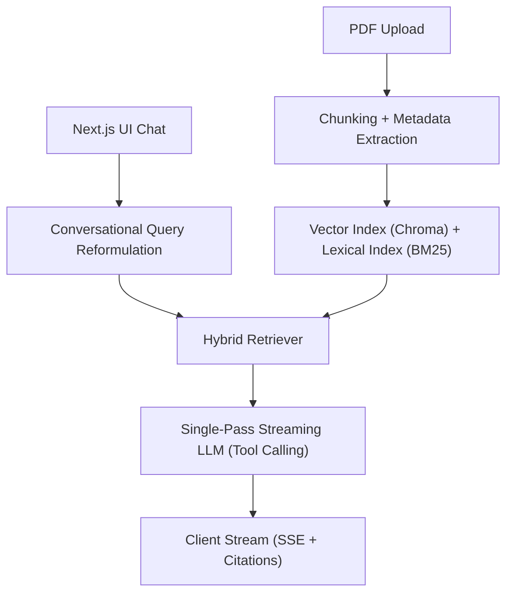

# DocuMind: Enterprise RAG Knowledge Engine


## Overview

DocuMind is a full-stack, context-aware, hallucination-resistant Retrieval-Augmented Generation (RAG) platform engineered for high-stakes document analysis. The system provides an end-to-end pipeline from PDF ingestion and metadata-preserving chunking, through hybrid dense+sparse retrieval, to multi-turn conversational answering with streaming generation. Responses are emitted with low perceived latency (sub-second TTFT in local deployments) and include verifiable, page-level citations so every generated claim can be traced back to source evidence.

## System Architecture



## Core Architectural Decisions

### 1) Ingestion & Chunking

DocuMind uses overlapping recursive text splitting to balance recall and precision: overlap reduces boundary-loss when facts span chunk edges, while bounded chunk size keeps prompt context predictable. Metadata is preserved and normalized at chunk time (`document_id`, `filename`, `page_number`, plus stable chunk identifiers), allowing the generation layer to reference exact source locations. This is a deliberate trade-off: additional metadata handling increases ingestion complexity but materially improves auditability and factual traceability.

### 2) Hybrid Retrieval (Chroma + BM25)

Dense retrieval (Chroma embeddings) captures semantic similarity, while BM25 captures strict lexical matches (acronyms, exact terms, policy IDs, product codes). The ensemble retriever combines both with explicit weighting to avoid overfitting to either semantic drift or keyword brittleness. On startup, the backend runs lifespan state recovery to rebuild the in-memory BM25 corpus from persisted vector-store documents, reducing cold-start failure modes after restarts and restoring retrieval continuity without requiring immediate re-upload.

### 3) Conversational Query Reformulation

For multi-turn sessions, DocuMind rewrites the latest user message into a standalone retrieval query using a lightweight LLM before search execution. This avoids context fragmentation where pronouns, ellipsis, or implicit references degrade retriever performance. The design separates retrieval intent from answer generation intent: retrieval is anchored on reformulated query semantics, while final response generation still receives the original user question and chat history.

### 4) Strict Grounding & Single-Pass Streaming

The generation stage is constrained by a strict system prompt and OpenAI tool-calling contract: answer only from retrieved context, emit explicit uncertainty when context is insufficient, and return structured citations that must match source metadata exactly. To reduce both latency and token cost, DocuMind streams answer tokens and accumulates tool-call arguments (citations) in the same model pass. This single-pass strategy avoids a second citation-validation generation step while preserving structured outputs for client rendering.

### 5) MLOps & Evaluation Pipeline

`backend/scripts/evaluate_rag.py` implements a pragmatic LLM-as-a-Judge evaluation loop over a golden dataset. The pipeline runs end-to-end retrieval and generation, then uses a structured judge model to score:

- **Faithfulness**: whether the answer is supported by the provided document evidence.
- **Answer Relevance**: whether the answer directly addresses the query.

Scores are emitted per sample and aggregated into final averages, enabling regression tracking and rapid comparison of retriever/prompt changes. This prioritizes system-level behavior over isolated component metrics, which is more representative of production RAG quality.

## Local Development Environment

### 1) Backend setup (Python 3.11)

```bash
cd backend
python3.11 -m venv .venv
source .venv/bin/activate
pip install --upgrade pip
pip install fastapi "uvicorn[standard]" langchain langchain-openai langchain-community langchain-text-splitters langchain-chroma chromadb pymupdf pydantic pydantic-settings python-multipart rank_bm25
```

### 2) Configure backend environment

Create `backend/.env`:

```env
OPENAI_API_KEY=your_openai_api_key
CHROMA_PERSIST_DIR=./chroma_data
```

Optional:

```env
CHUNK_SIZE=1000
```

### 3) Start FastAPI backend

```bash
cd backend
source .venv/bin/activate
uvicorn main:app --host 0.0.0.0 --port 8000 --reload
```

### 4) Frontend setup and run (Next.js)

```bash
cd frontend
npm install
NEXT_PUBLIC_API_URL=http://localhost:8000 npm run dev
```

Frontend runs at `http://localhost:3000` and streams chat responses from the backend SSE endpoint.

## API Reference

| Method | Endpoint | Description | Request Body | Response |
| --- | --- | --- | --- | --- |
| `POST` | `/api/v1/documents/upload` | Uploads a PDF, extracts page text, chunks content, and indexes chunks for hybrid retrieval. | `multipart/form-data` with field `file` (PDF) | JSON: `{ "chunks_generated": <int> }` |
| `POST` | `/api/v1/chat/stream` | Streams grounded answer tokens and final citation payload for a conversational query. | JSON: `{ "session_id": "<uuid>", "query": "<string>" }` | `text/event-stream` (`token`, `final`, `error`, `[DONE]`) |

## Author

**Artem Moshnin** (Full-Stack Software & ML Engineer)

* [Personal Website](https://artemmoshnin.com)
* [LinkedIn](https://linkedin.com/in/amoshnin)
* [GitHub](https://github.com/amoshnin)
